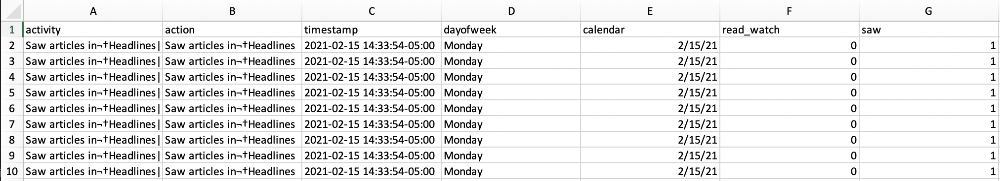
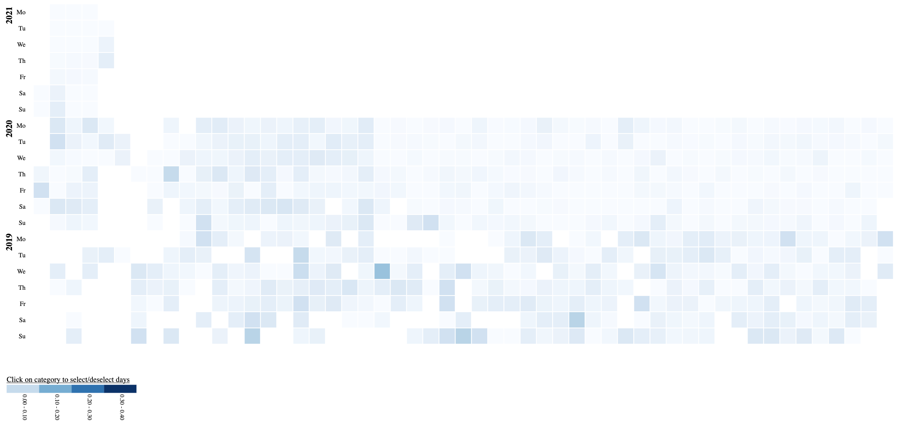
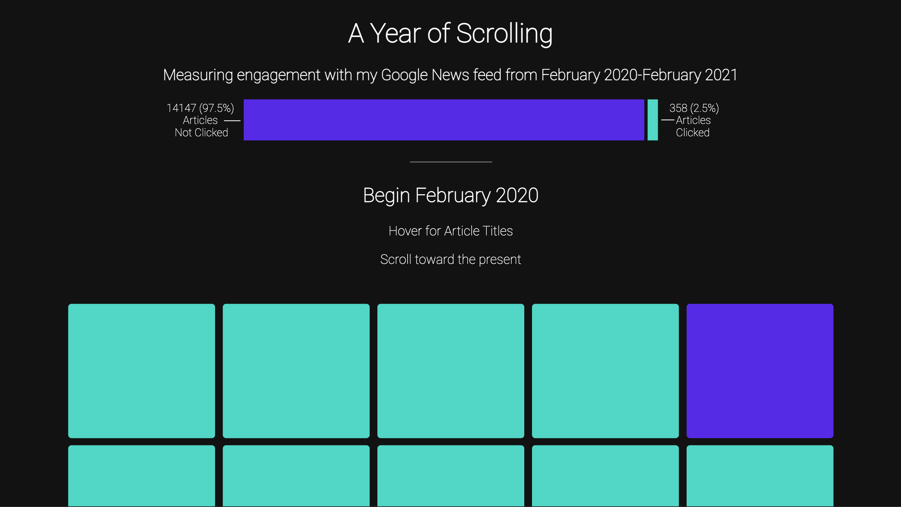

# A Year of Scrolling
### [Final Visualization](https://justinkraus.github.io/news/)

Visualizing engagement with my google news feed from February 2020 to February 2021.

## Data
### Input
I used [Google takeout](https://takeout.google.com/) to download my google news history. This provides a history of all activity within google news as an html file, here’s an example snapshot:

### Output
I used beautfiulsoup to scrape, formatted with pandas and output the data into a tabulated view that can be used for visualizing; the python script for that can be found here [google_news_scrape.py](https://github.com/justinkraus/news/blob/master/google_news_scrape.py). A view of the output is shown here

## Visualization
### Iteration One

My initial intention with this visualization was to observe daily ratios of the number of articles viewed to clicked. However it became clear that the ratio was pretty low with the exception of some outlier days that were skewing the results. This created an underwhelming heatmap, I created a version of this in d3 which can be seen here:

### Iteration Two

I revisited the data and decided to both show more and less detail in the final version:

-   Aggregate the information at the highest level for an overall ratio
-   Show representations of each individual article

## Final Observations

The final version also includes the titles of articles I clicked into, providing a glimpse at some things that actually inspired me enough to click.

The final includes a lot of articles to scroll through which is tedious but also provides a true representation of the familiar scrolling process and illustrates the passive amount of content that's we consume on a daily basis.