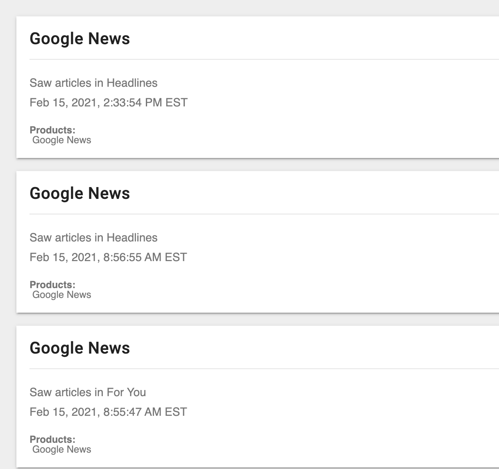

# A Year of Scrolling
### [Final Visualization](https://justinkraus.github.io/news/)

Visualizing engagement with my google news feed from February 2020 to February 2021.

## Data
### Input
I used [Google takeout](https://takeout.google.com/) to download my google account activity. Included in the takeout data is a history of my browsing activity within google news, an app I use almost daily to browse headlines. The browsing activity is provided as an html file, here’s an example snapshot:

### Output
With Python I used beautfiulsoup to scrape and pandas to restructure, format and output the data into a tabulated view for visualizing. The python script for that can be found here [google_news_scrape.py](https://github.com/justinkraus/news/blob/master/google_news_scrape.py). A snapshot of the final output file is shown here:

## Visualization
### Iteration One

My initial intention was to observe daily ratios of the number of articles viewed to clicked. However it became clear that the ratio was overally pretty consistent with the exception of some outlier days that were skewing the results. I used d3 to create a heatmap but the overall story wasn't translating well to a visual:

### Iteration Two

I revisited the data and decided to split the final visual into two versions that present the data with different levels of detail:

-   An overall summary to display the click/view ratio for all articles:

-   Show representations of each individual article with a hover feature for the articles clicked to provide the headline:

## Final Observations

The final version also includes the titles of articles I clicked into, providing a glimpse at some things that actually inspired me enough to click. While scrolling through the full detail view is time consuming, it provides a true representation of the familiar scrolling process and illustrates the passive amount of content that's we consume on a daily basis. Additionally this shows how my reading habits changed throughout the pandemic. For those uninterested, the high-level summary provides a quick glimpse.